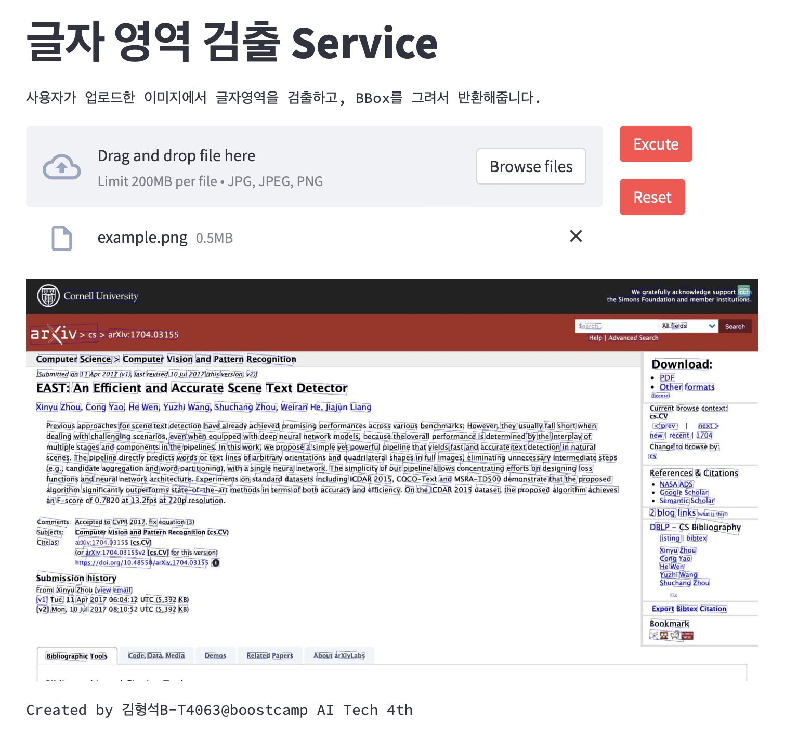

# App.Streamlit-FastAPI.Text.Detector

OCR Task 중 하나인 Text Detection을 수행할 수 있는 Web Service의 저장소 입니다.

|Example Page|
|--|
||


## Install

- python 3.8.15가 필요합니다.

```bash
pip3 install -r requirments.txt

or

pipenv install -r requirments.txt

```

## Streamlit 실행(frontend)

```python
python -m frontend
```

## FastAPI 실행(backend)

```python
python -m backend
```
